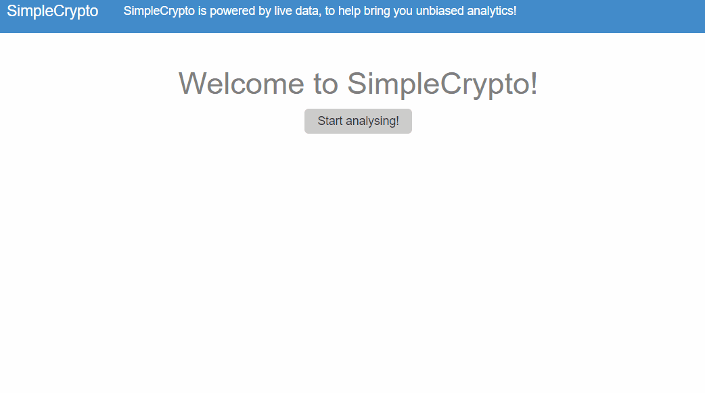

# CryptoProject
[](https://ci.appveyor.com/project/Kaymo1990/cryptoproject)

### What is SimpleCrypto?

This project uses live data via the Coingecko API to get pricing data for crypto-assets and analyse it using technical analysis such as looking at 100d volatility and moving averages.
This data is returned to the user in an easy to understand statement with what the data means from an unbiased perspective. The idea is looking to address to concept of readily available data that is tailored towards the average person, simplifying figures to be easily interpreted so everyone can make more informed choices!



-------

### Installation and testing

```sh
$ git clone this repo
$ run command rackup config.ru and go to http://localhost:9292/
$ Search for a cryptocurrency using the full name e.g. bitcoin and click analyse to see the analysis
```
To run tests, change to the root directly and run the command 'rspec'

-------

### CI/CD

Appveyor is the CI tool with the current build passing.
Heroku is used for deployment, to view the deployed version of the application, please visit:
https://hidden-cliffs-80375.herokuapp.com/

-------

### Built With

* Ruby
* Sinatra
* Coingecko API
* Bootstrap
* Puma
* Capybara

------
